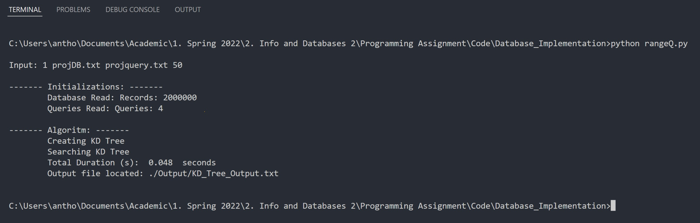

## Programming Assignment - Info and Databases 2

*Created by:  Anthony Khoury | anthony14khoury@gmail.com*

---

### In the command line, run the following
- `make`
- `python3 rangeQ.py`
- `1 projDB.txt projquery.txt 50`
     - These are the parameters you change for different runs

Example:

